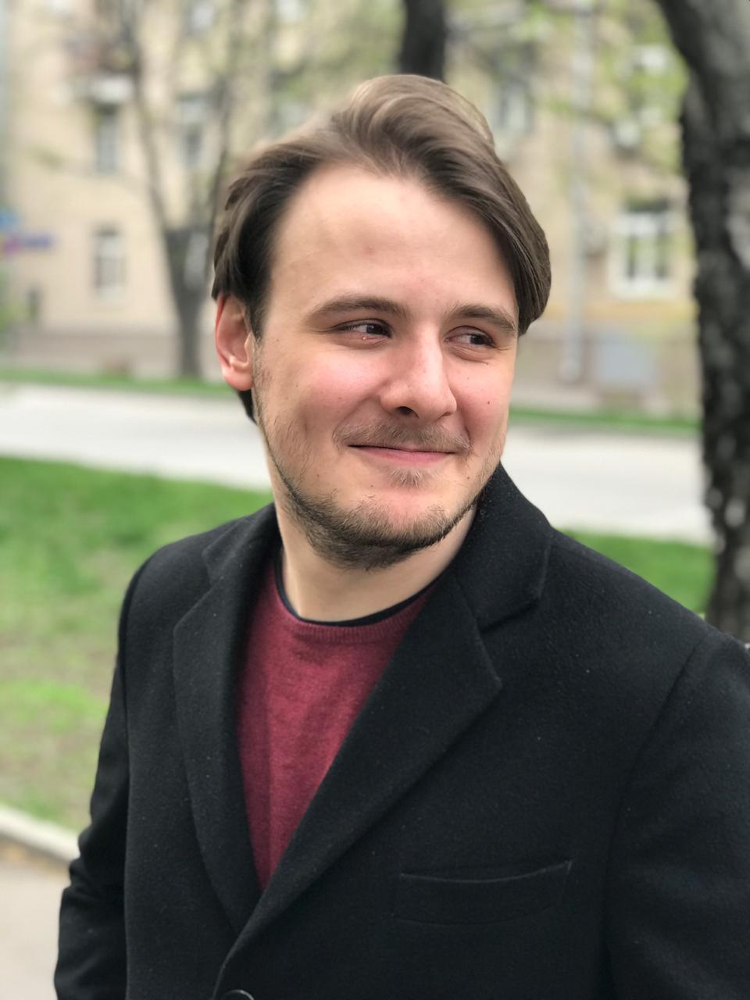

# **Педагог-психолог**
## **Горбунов Кирилл Александрович**

__27 лет, г. Москва__

## **Образование:** 

[**НИУ ВШЭ**](https://www.hse.ru/ba/psy/) - __бакалавр__, Психология

[**МВШСЭН**](https://www.msses.ru/magistratura/psikhologicheskoe-konsultirovanie/) - __магистр__, Психологическое консультирование

## **"Школа "Летово"**
**Педагог-психолоог** 
с 2018 по н.в.
* Консультирование детей по запросу
* Консультирование педагогов и родителей по работе с детьми
* Проведение психологических диагностик
* Проведение тренингов (тревожность, тайм-менеджмент, стресс, выгорание, прокрастинация)
* Проведение годового курса _"Введение в психологию"_
* Участие в приемной компании по набору учащихся
* Наблюдение на уроках
* Семинары для педагогов

## **Школа №1347**
**Педагог-психолог** с 2017 по 2018
* Консультирование детей по запросу
* Консультирование педагогов и родителей по работе с детьми
* Проведение психологических диагностик
* Проведение тренингов
* Коррекционная работа с детьми ОВЗ
* Составление характеристик для КДН и ЦПМПК
* Профилактическая работа среди учащихся по употреблению ПАВ

## **1C-Архитектор бизнеса**
**Менеджер по подбору персонала** 2017
* Подбор кандидатов по входящим заявкам
* Написание комментариев по кандидатам
* Составление описаний вакансий
* Проведение телефонных собеседований
* Участие в первичных собеседованиях с кандидатом
* Обзвон холодной базы кандидатов

## **О себе:**

Работаю в *Клиенто-центрированном* и *Ориентированным на решения подходах* с подростами от 13 до 18 лет.

**Основные темы запросов:**
* тревожность
* прокрастинация
* сепарация с родителями
* профориентация
* низкая самооценка
* одиночество
* перфекционизм

В своей работе опираюсь на развитие у подростков рефлексии, создании искренних и безусловно поддерживающих терапевтических отношений и работе с личностью, как системой.

**Повышения квалификации:**
* ЦДО ООО "Столичный образовательный центр" - _професиональная переподготовка_, Педагог-психолог. Преподаватель психологических дисциплин.
* ИОКП - _професиональная переподготовка_, Психология суицидального поведения; _повышение квалификации_, Психиатрия для психологов.
* АНО ВО "МИСАО" - _повышение квалификации_, Технологии краткосрочной индивидуальной диагностической и коррекционно-развивающей работы у детей и подростков с эмоциональными нарушениями.

